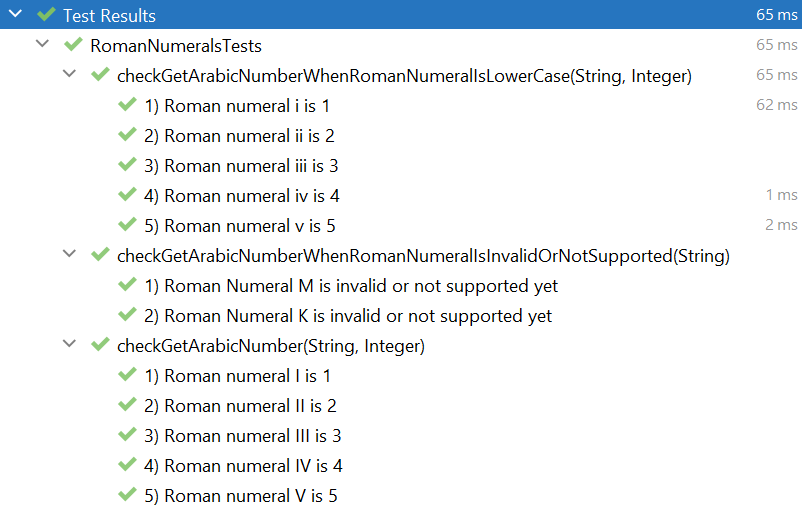

# TDD roman numerals kata
Test Driven Development exercise for roman numeral conversions.

### What is a kata?

A Kata in martial arts means “a system of individual training exercises”. Just like in martial arts, coding also requires consistent practise to hone in the skill.

### What is the goal?

Plan out and spend 30-45 minutes having a go at the Roman Numerals Kata using Test-Driven Development. It is not expected to have a finished solution but have had a good go at using Test-Driven Development.

### Instructions

- Read the Roman Numerals Kata requirements at Coding Dojo: https://codingdojo.org/kata/RomanNumerals
- Solve the Roman Numerals kata in Java programming language.

### Solution:
- Actual solution converts roman numerals up to 5. It is only a class helper with tests.
- I started writing simple tests and at some point they were refactored as parameterised tests for simplification.
- The code also started from a simple solution to make the initial tests pass, then evolving to a more complex code until it reached its refactoring stage.   
- Please check the commits to see how was the TDD process.
- Please also feel free to clone the code and run all the tests locally.

Here you have quick overview of all the tests passing:

### What's next?:
- Continue developing the solution for roman numerals above 5.
- Start implementing the conversion from Arabic numbers to roman numerals.
- Add more edge case tests, like when parameter passed is null or empty.
- Add regular expression to validate input for roman numerals.

---
## How to run the tests
- cd to the project root folder in the command line
- ``mvn test``
 
## Technology
This project was built using:
- Java version 17.0.2
- JUnit 5.8.2 for unit testing
- Apache Maven 3.8.5 as project manager
- Community Edition for the IntelliJ 2021.3.2 development environment.
